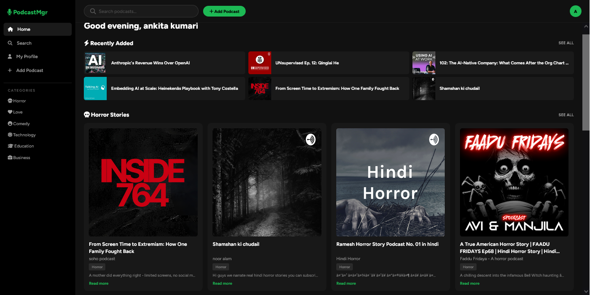
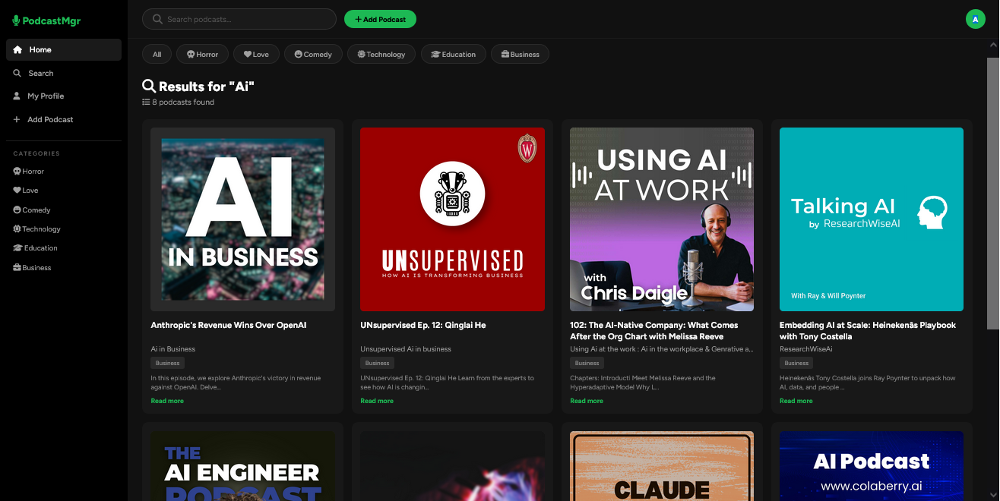
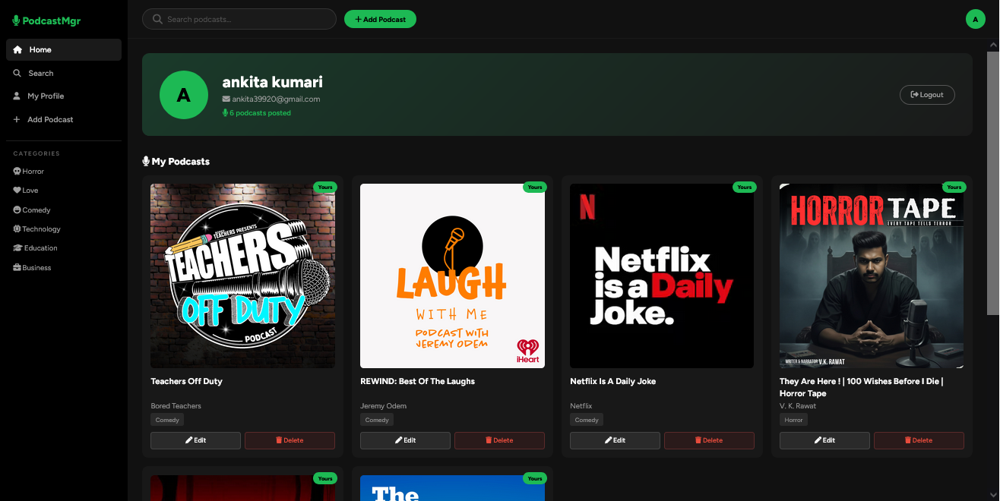

#  PodcastMgr — Spotify-inspired Podcast Streaming App

> A full-stack podcast management web application built with Spring MVC, JSP, and MySQL — inspired by Spotify's dark UI design.

---

##  Screenshots

> *(Add screenshots of your app here after uploading)*

| Home Page | Search Page | Profile Page |
|-----------|-------------|--------------|
|  |  |  |

---

##  Features

-  **Real Audio Streaming** — Play real podcast episodes directly in browser using HTML5 Audio API
-  **RSS Auto-Fetch** — Paste any RSS feed URL and cover image + audio are extracted automatically using Java XML DOM Parser
-  **Session-based Authentication** — Secure login, signup and logout with automatic redirect for unauthorized access
-  **Ownership-based Access Control** — Users can only edit/delete their own podcasts
-  **Full CRUD** — Add, edit, delete and search podcasts by title, author or category
-  **Full Player Controls** — Play, pause, next, previous, seek bar, volume control, 10s back / 30s forward skip
-  **Smart Search** — Search by title, author or category
-  **Category Filter** — Filter by Horror, Love, Comedy, Technology, Education, Business
-  **Profile Page** — View and manage your own podcasts with edit/delete buttons
-  **Landing Page** — Public landing page with real podcast data and interactive app preview
-  **Cloud Database** — MySQL hosted on TiDB Cloud with backup and point-in-time restore

---

##  Tech Stack

| Layer | Technology |
|-------|-----------|
| Backend | Java, Spring MVC |
| Frontend | JSP, HTML5, CSS3, JavaScript |
| Database | MySQL (TiDB Cloud) |
| ORM/DB | NamedParameterJdbcTemplate (JDBC) |
| Server | Apache Tomcat 9 |
| Icons | Font Awesome 6.5 |
| Fonts | Google Fonts (Figtree) |
| IDE | NetBeans |

---

##  Project Structure

```
SqlUtilityCrud/
├── src/
│   └── java/
│       └── com/mycompany/sqlutilitycrud/
│           ├── controller/
│           │   ├── UserAuthController.java
│           │   └── PodcastController.java
│           ├── dao/
│           │   ├── UserDao.java
│           │   └── PodcastDao.java
│           └── model/
│               ├── Users.java
│               └── Podcast.java
├── web/
│   ├── WEB-INF/
│   │   ├── jsp/
|   |   |__pages/
│   │   │   ├── home.jsp
│   │   │   ├── profile.jsp
│   │   │   ├── search.jsp
│   │   │   ├── login.jsp
│   │   │   ├── index.jsp
│   │   │   ├── landing.jsp
│   │   |── components/
│   │   │   ├── sidebar.jsp
│   │   │   ├── topbar.jsp
│   │   │   └── playbaar.jsp
│   ├── CSS/
│   │   └── Style.css
│   │   └── landing.css
│   │   └── login.css
│   │   └── signup.css
│   └── js/
│       └── script.js
```

---

##  Database Schema

```sql
-- Users Table
CREATE TABLE users (
    ID INT AUTO_INCREMENT PRIMARY KEY,
    Name VARCHAR(100) NOT NULL,
    Email VARCHAR(150) NOT NULL UNIQUE,
    Password VARCHAR(100) NOT NULL
);

-- Podcasts Table
CREATE TABLE podcasts (
    id INT AUTO_INCREMENT PRIMARY KEY,
    title VARCHAR(255) NOT NULL,
    author VARCHAR(150) NOT NULL,
    category VARCHAR(100) NOT NULL,
    description TEXT,
    cover_image_url VARCHAR(500),
    feed_url VARCHAR(500) NOT NULL,
    audio_url VARCHAR(500),
    user_id INT NOT NULL,
    created_at TIMESTAMP DEFAULT CURRENT_TIMESTAMP,
    CONSTRAINT fk_podcast_user
        FOREIGN KEY (user_id)
        REFERENCES users(ID)
        ON DELETE CASCADE
);
```

---

##  How to Run Locally

### Prerequisites
- Java JDK 8 or above
- Apache Tomcat 9
- MySQL or TiDB Cloud account
- NetBeans IDE (recommended)

### Steps

**1. Clone the repository**
```bash
git clone https://github.com/rupalshukla82/PodcastMgr.git
cd PodcastMgr
```

**2. Setup Database**
- Create a MySQL database named `user`
- Run the SQL schema above to create tables
- Insert some initial podcast data

**3. Configure Database Connection**

Find your database config file and update:
```properties
jdbc.url=jdbc:mysql://your-host:3306/user?sslMode=VERIFY_IDENTITY
jdbc.username=your-username
jdbc.password=your-password
```

**4. Deploy on Tomcat**
- Open project in NetBeans
- Right click project → Run
- App opens at `http://localhost:8080/SqlUtilityCrud/landing.fin`

---

## Pages & Routes

| Route | Description |
|-------|-------------|
| `/landing.fin` | Public landing page |
| `/index.fin` | Signup page |
| `/login.fin` | Login page |
| `/home.fin` | Home dashboard (requires login) |
| `/profile.fin` | User profile page |
| `/podcast/search.fin` | Search podcasts |
| `/podcast/category.fin?cat=Horror` | Filter by category |
| `/podcast/add.fin` | Add new podcast (POST) |
| `/podcast/update.fin` | Update podcast (POST) |
| `/podcast/delete.fin` | Delete podcast (POST) |
| `/logout.fin` | Logout |

---

##  How RSS Feed Works

```
User pastes RSS URL
        ↓
Spring MVC fetches RSS XML
        ↓
Java XML DOM Parser extracts:
  → cover_image_url (from <itunes:image> or <image><url>)
  → audio_url (from <enclosure url="">)
        ↓
Both saved to MySQL DB
        ↓
Frontend plays audio_url directly in HTML5 Audio player
```

---

##  Author

**Rupal Shukla**
- Email: shuklarupal82@gmail.com
- LinkedIn: [linkedin.com/in/rupal-shukla-932143299](https://linkedin.com/in/rupal-shukla-932143299)
- GitHub: [github.com/rupalshukla82](https://github.com/rupalshukla82)

---

## 📄 License

This project is open source and available under the [MIT License](LICENSE).

---

> Built with ❤️ using Spring MVC, JSP and MySQL
